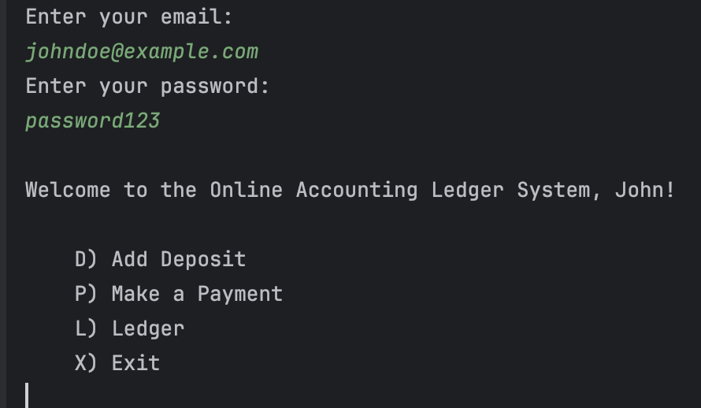

# CapstoneOne_AccountingLedger

## Understanding the problem

- Inputs
    - User input

- Outputs
    - Command-Line Interface (CLI)
    - Creating an application that allows the user to view all transactions, add transactions, and to see their reports

## Making a plan
``
// Pseudocode
//Inputs
// Using Scanner to take an initial user menu command
// First welcoming the user to the online banking system, then allowing the user to decide if they want to add a deposit, make a payment, look at their ledger or exit the program.
// After the prompt the use will input a letter
// There will be a menu for each option except the exit option to allow the user exit the application
// The ledger will have a menu for all entries, deposits, payments, reports and an option to return back to the home screen
// The application will print to the CLI the result of the user options
``

## SnapShots of the code working

### Home screen and deposit

### Ledger 

